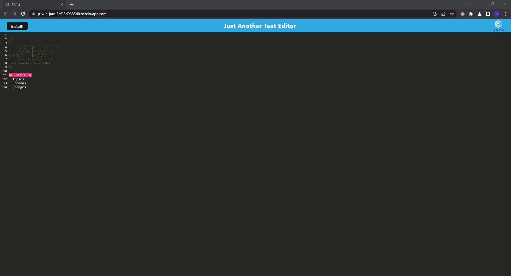
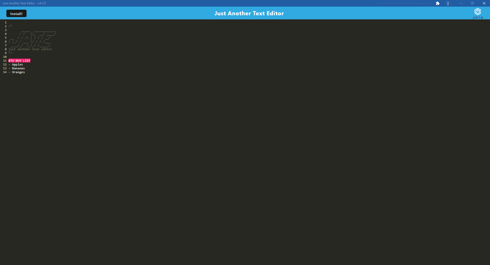

# text-editor

## Description

A text editing application that takes notes with or without an internet connection.

## Table of Contents

- [Installation](#installation)
- [Usage](#usage)
- [Screenshot](#screenshot)
- [Resources](#resources)
- [License](#license)

## Installation

This application can be run through the browser using the deployed link. Alternatively, the application can be run locally using the following instrctions:

1. Download or clone this repository
2. [node.js](https://nodejs.org/en) is required for this application
3. `npm i` in the terminal to install the required npm packages
3. `npm run start` to invoke the application
4. Use the following link to run the application: http://localhost:3000/

## Usage

Acess the application using the following deployed [link](https://p-w-a-jate-5cf98d9385d0.herokuapp.com/).

Once redirected, create and edit text as desired.

Click the `install` button to use the application offline.

## Screenshot

This is the general setup when opening the application.

**Online Application**

**Offline Application**

## Resources

- [Webpack Documentation](https://webpack.js.org/guides/)

- [Service Workers Documentation](https://developer.mozilla.org/en-US/docs/Web/API/Service_Worker_API/Using_Service_Workers)

## License

Please refer to the LICENSE in the repo.

---

